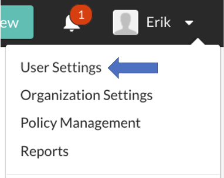
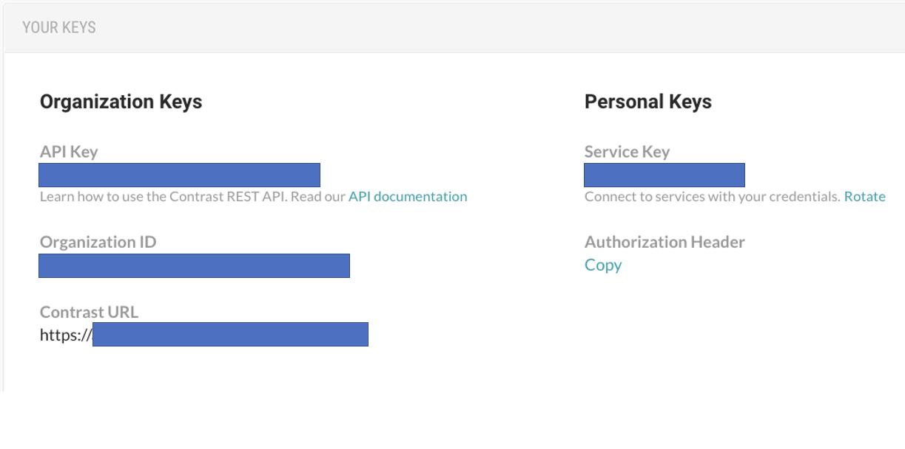

The recent log4j vulnerability provides an opportunity to demonstrate the Contrast API for two reasons:

 1. Teams who want to know if they are impacted can quickly do so and know where to patch.
 2. Teams who want more can read and change the code to answer additional questions.

Right now we have [two scripts](https://github.com/Contrast-Security-OSS/CVE-2021-44228) that help teams find out if their applications are affected and specifically which applications fall into that group. One is in Python, the other is in Powershell -- simply choose the one that is easiest for you to use.

The way that we can locate these applications is:

 * Data is gathered through any Contrast-monitored application. Information is gathered from custom code, third party code, and even vendor software.
 * The data is collected for monitoring in the Contrast UI and its tracking system. In the case of log4j2, we want to use the library inventory to know which custom and third party applications are affected.
 * The custom script queries the data, making a nice list of where to look that can easily integrate with other tools.

Seeing Where You Are Impacted To see where you are impacted, set environment variables. You can locate these by logging in and clicking the upper right, user settings.

 * CONTRAST_AUTH_TOKEN - the authorization header.
 * CONTRAST_API_KEY - the API Key.
 * CONTRAST_ORG_ID - The Organization ID.
 * CONTRAST_API_URL - The hostname of your instance, such as https://app.contrastsecurity.com/

Run the script and you will get a list of which applications are impacted. You can open it with any tool.

## Which APIs are used

All data is loaded from the public [Contrast API](https://api.contrastsecurity.com/). Specifically this uses a few API calls:

 * /libraries - lists the libraries that are used by different applications throughout the organization.
 * /applications - provides application details, each time the log4j2 library if located.
 * users - identifies the full scope of your permissions to ensure we search everywhere.