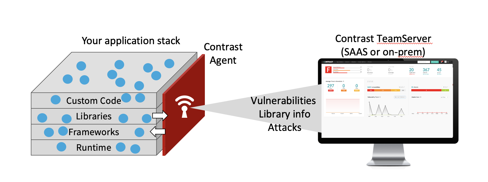

# Where do I start

There are a few different technologies that developers can use to secure builds. The easiest path for the most success with the least work is:

At the end of this setup, you will have automated tools that check your code and libraries for security defects. Results will appear locally and pass through a service that supports your IDE and other workflow tools.

## 1. Set Up Your Free Account

Create a free [Contrast Community Edition Account](https://www.contrastsecurity.com/contrast-community-edition)

Developers with a commercial Contrast subscription should log in to the Contrast tenant for their orgranization.

## 2. Choose your language

- [Java](tutorial-java/securing-build-time)
- [.NET](tutorial-dotnet/dotnet) / [.NET Core](tutorial-dotnet-core)
- [Ruby](tutorial-ruby/index)
- [Python](tutorial-python/index)
- [Node.js](tutorial-node/index)
- [Go](tutorial-go/index)
- [Security team helping many developers](security-teams/index)