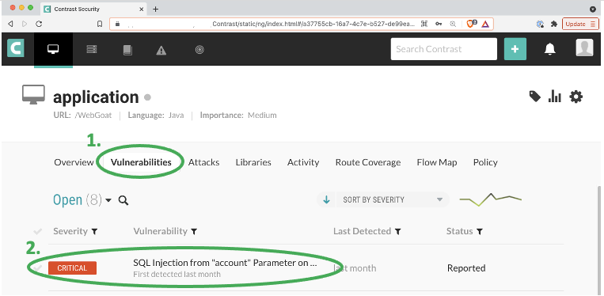
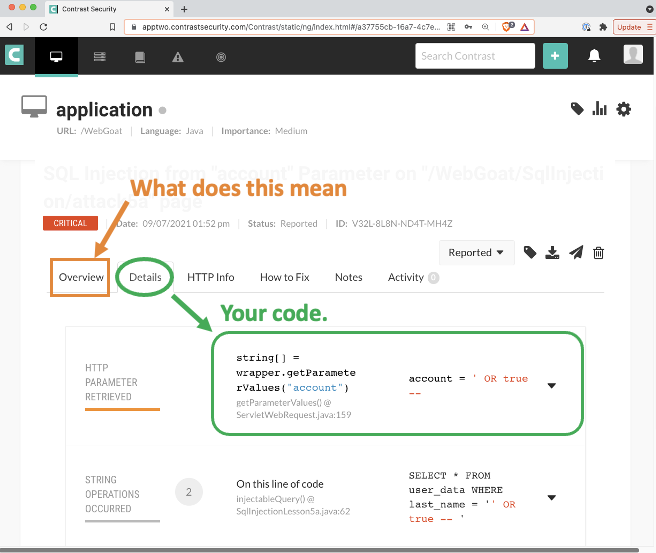

Security results are made available in a central console for review, where they can integrate into other systems. 
Developers benefit from looking at security results because they can act on and fix any issues.
Security teams benefit from looking at results to understand where they can help. from using the analyzer to improving architecture by partnering up.

Results can be viewed in several ways:
- [Through a web browser](#viewing-your-results-web) (most common)
- [Through an IDE plugin (for developers)](#viewing-your-results-ide-plugin)
- [Linked with other systems](https://www.contrastsecurity.com/application-lifecycle-integrations), such as in-chat links when new vulnerabilities are found.

## Viewing Your Results (Web)

1. Open your Contrast UI console.
1. Locate your application on the Applications tab.
1. Select the vulnerabilities tab and open an issue.

### Interpreting a Result

Vulnerabilities are split into different severities. Developers focused on fixing vulnerabilities should focus on Critical issues first.

- The **Overview** section explains what the vulnerability is and how it was observed in the application.
- The **Details** tab provides a code-level stacktrace that explains how data moved in the application to locate this vulnerability. This tab contains the most information relevant for developers to fix an issue in code.
- **How to Fix** provides some guidance on what secure code looks like compared to vulnerable code. Developers should compare this against code present on the Details tab.

### Verifying Your Fix with a Re-Test

Once you fix a result, simply re-run the impacted code with the security monitoring agent. The agent will detect any related changes to the code and automatically close the issue.

## Viewing Your Results (IDE Plugin)

Contrast offers the ability to view (and often generate) security results in an IDE plugin. The benefit is that certain links and elements can navigate directly to the code in your editor, and new security results can stream to you as they are discovered.

[Obtain your plugin](https://www.contrastsecurity.com/application-lifecycle-integrations) for many IDEs, including:
- Eclipse
- IntelliJ
- Visual Studio / VS Code
- Many others